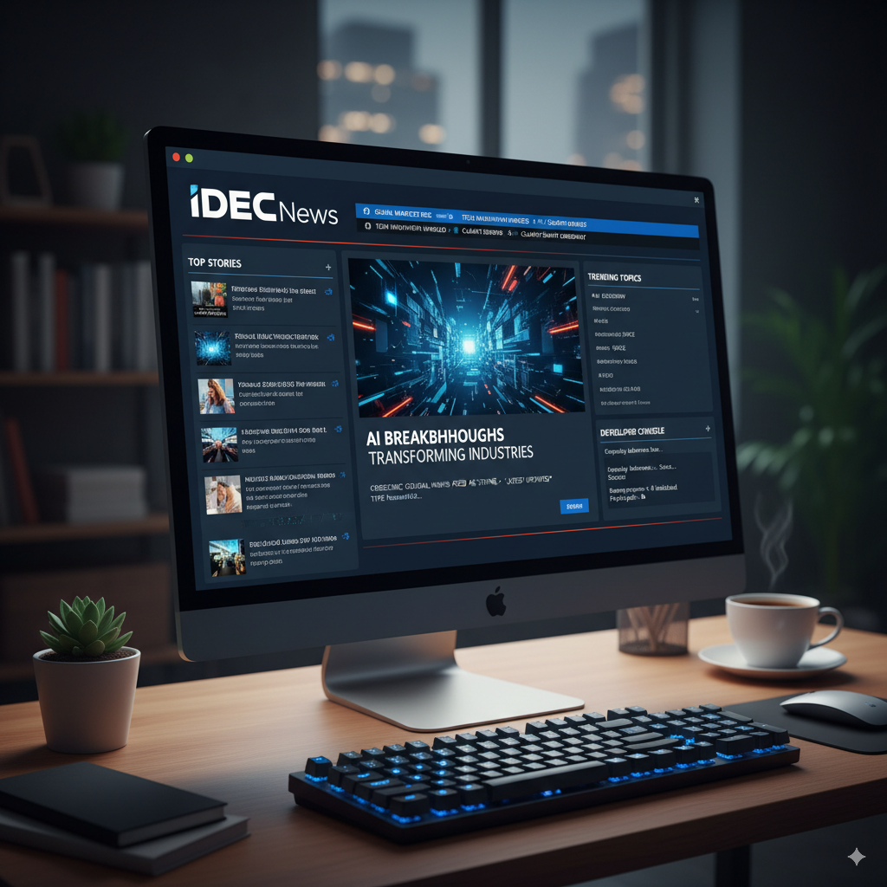

I can help you create a `README.md` for your IDECNews Desktop CNN project. Here's a possible structure:


_____

```markdown
# IDECNews Desktop CNN

## Project Overview

IDECNews is a desktop application designed to deliver news content, similar to a CNN-style interface. This project is developed using FreeBASIC and aims to provide a localized and efficient news consumption experience.

## Features

*   **News Display:** Presents news articles in a clear and organized manner.
*   **Desktop Application:** A standalone application for easy access to news.
*   **FreeBASIC:** Developed with the FreeBASIC programming language, ensuring efficient performance.
*   **Customizable:** (Optional - if applicable) Mention any potential for user customization or configuration.

## Technologies Used

*   **Language:** FreeBASIC
*   **IDE:** (Mention if you use a specific IDE or text editor like FBEdit, VS Code with FreeBASIC extensions, etc.)

## Getting Started

### Prerequisites

*   FreeBASIC Compiler (Installation instructions or link to FreeBASIC website)

### Installation

1.  **Clone the repository:**
    ```bash
    git clone https://github.com/your-username/IDECNews.git
    ```
2.  **Navigate to the project directory:**
    ```bash
    cd IDECNews
    ```
3.  **Compile the source code:**
    ```bash
    fbc -lang fb -g -w all -O 3 -max-err 50 "your_main_source_file.bas"
    ```
    *(Replace `"your_main_source_file.bas"` with the actual name of your main FreeBASIC source file, e.g., `main.bas` or `IDECNews.bas`)*

### Running the Application

After successful compilation, an executable file (e.g., `your_main_source_file.exe` on Windows, or `your_main_source_file` on Linux) will be created in the project directory.

Run the application:
```bash
./your_main_source_file  # On Linux
./your_main_source_file.exe # On Windows
```

## File Globals (`globals.bi`)

The `globals.bi` file is expected to contain global declarations, constants, and shared variables used throughout the IDECNews application. This typically includes:

*   **Constants:** For screen dimensions, color codes, API keys (if applicable), etc.
*   **Global Variables:** For application state, user settings, news data structures, etc.
*   **Type Definitions:** Custom data types used across multiple modules.

*(Example content for `globals.bi` - you'll need to fill this with your actual global definitions):*

```freebasic
' globals.bi

#ifndef __GLOBALS_BI__
#define __GLOBALS_BI__

' Screen dimensions
CONST SCREEN_WIDTH = 1024
CONST SCREEN_HEIGHT = 768

' Colors
CONST COLOR_BACKGROUND = &h000000 ' Black
CONST COLOR_FOREGROUND = &hFFFFFF ' White
CONST COLOR_ACCENT = &h0000FF    ' Blue

' News article structure
TYPE NewsArticle
    Title AS STRING
    Content AS STRING
    ImageUrl AS STRING
    Link AS STRING
END TYPE

' Global news article array (example)
DIM SHARED NewsFeed(10) AS NewsArticle

#endif ' __GLOBALS_BI__
```

## Project Structure

```
/.hyijsylb/
├── src/                    # Source code files
│   ├── main.bas
│   ├── news_parser.bas
│   ├── ui_elements.bas
│   └── ...
├── globals.bi              # Global declarations and constants
├── assets/                 # Images, icons, fonts, etc.
│   └── ...
├── README.md               # This file
└── (other project files)
```

## Contributing

(Optional - if you plan to accept contributions)

If you'd like to contribute to IDECNews, please follow these steps:

1.  Fork the repository.
2.  Create a new branch (`git checkout -b feature/your-feature-name`).
3.  Make your changes.
4.  Commit your changes (`git commit -m 'Add some feature'`).
5.  Push to the branch (`git push origin feature/your-feature-name`).
6.  Open a Pull Request.

## License

(Optional - specify your chosen license, e.g., MIT, GPL, etc.)

This project is licensed under the [MIT License](LICENSE).

## Contact

(Optional - how people can reach you)

If you have any questions or suggestions, feel free to open an issue or contact [Your Name/Email].
```

**Key things you need to customize in the `README.md`:**

*   **`https://github.com/your-username/IDECNews.git`**: Replace with your actual repository URL.
*   **`your_main_source_file.bas`**: Replace with the name of your main FreeBASIC source file (e.g., `main.bas`).
*   **`src/` content**: List the actual FreeBASIC source files you have.
*   **`globals.bi` example content**: Fill this with the actual global declarations, constants, and types you have in your `globals.bi` file.
*   **Features, Contributing, License, Contact**: Fill these sections with your specific details.

Let me know if you'd like an image to go with this! For example, a stylized logo for IDECNews or a screenshot mockup of the application. 